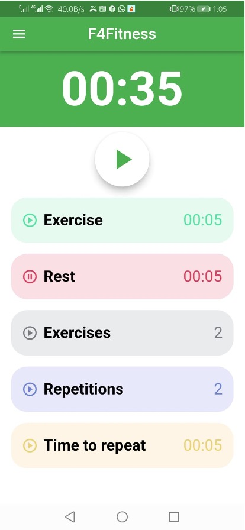
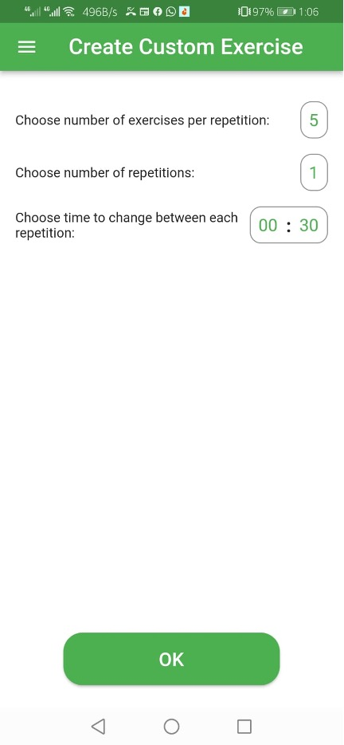
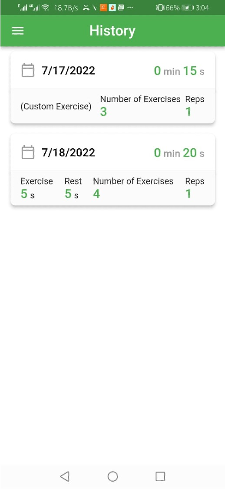
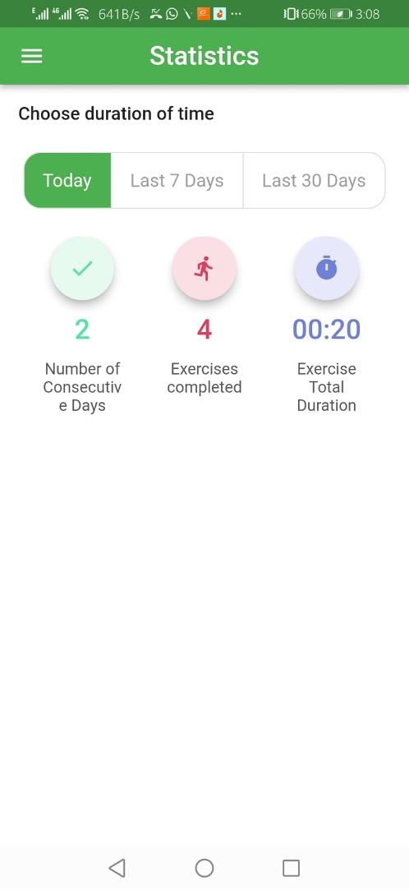
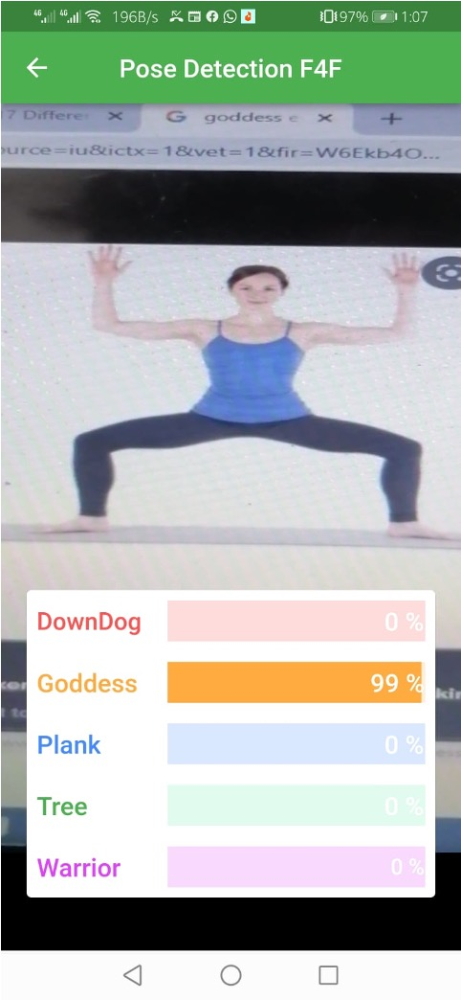

# F4Fitness – Fitness & Health Android App

**Final Year Project (2021–2022)**
By [Syed Ali Shanawar Jaffri](#) & [Muhammad Shahan Ahmed](#)
Supervised by *Mr. Mohsin Raza Khan*
Hamdard University – Faculty of Engineering Sciences and Technology

---

## 📖 Overview

F4Fitness is a **mobile application** designed to help individuals improve their health and fitness with structured workout programs, exercise guides, history tracking, pose detection, and performance statistics. The app was developed as a **Final Year Project (FYP)** for the Bachelor of Science in Software Engineering program.

The app provides beginner-friendly training guidance without requiring a personal trainer and can be used at home or in the gym.

---

## ✨ Features

* **Workout Training Module** – Customize sets, reps, rest time, and duration.
* **Exercise Library** – Preloaded exercises with text + GIF tutorials.
* **History Tracking** – View past workouts and progress logs.
* **Statistics Dashboard** – Track total time, number of exercises, and consecutive workout days.
* **Pose Detection** – Integrated computer vision to check pose accuracy during workouts.
* **Settings** – Customizable workout guide sounds and preferences.
* **Notifications** – Reminders based on past workout patterns.

---

## 🛠️ Tech Stack

* **Frontend:** Flutter (Dart)
* **Backend & Auth:** Firebase Realtime Database
* **Design Tools:** Figma, GIMP
* **IDE:** Android Studio

---

## 📱 Screens & Modules
## 📸 Screenshots

### Home & Exercise



### History & Statistics



### Pose Detection



* **Splash & Authentication:** Sign-up / Login
* **Home Screen:** Quick access to training, exercises, stats, and history
* **Training Module:** Start workouts with configurable parameters
* **Exercise Module:** Visual + textual guides
* **History Module:** Workout records with date/time logs
* **Statistics Module:** Track progress with graphs and metrics
* **Pose Detection Module:** ML-based posture accuracy estimation

---

## 🚀 Getting Started

1. Clone the repository:

   ```bash
   git clone https://github.com/yourusername/F4Fitness.git
   ```
2. Open the project in **Android Studio**.
3. Install dependencies using Flutter:

   ```bash
   flutter pub get
   ```
4. Connect your Firebase project (update `google-services.json`).
5. Run on emulator or physical device:

   ```bash
   flutter run
   ```

---

## 📈 Project Scope & Future Work

* Expand the exercise library with more categories.
* Improve pose detection accuracy with advanced ML models.
* Add nutrition and meal planning modules.
* Introduce social/community features for motivation.

---

## 🏅 Acknowledgements

Special thanks to **Hamdard University** and **Engr. Mohsin Raza Khan** for guidance and support during this project.

---

## 📜 License

This project was developed as an academic FYP and is shared publicly for learning and reference purposes.
Feel free to fork, explore, and improve upon it.
